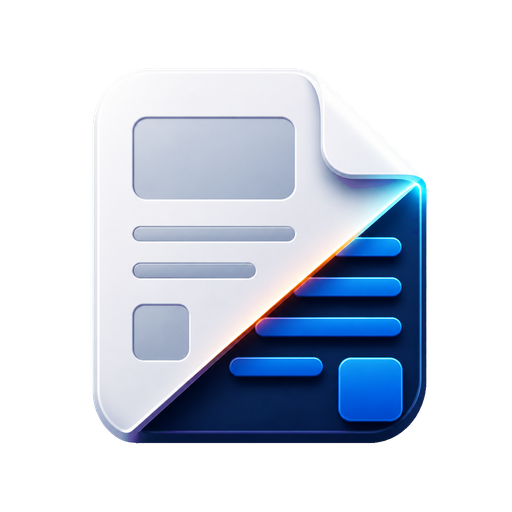

<p align="left">
  
</p>

# Exitpress

[](https://codecov.io/gh/mym0404/exitpress)

Every post deserves an exit.

Exitpress는 공개 블로그 글을 스캔해 Markdown, frontmatter, 로컬 자산, 복구 가능한 `manifest.json`으로 export하는 도구입니다. 지금은 Naver Blog 공개 글 수집을 지원하며, 여러 블로그 플랫폼을 추가할 수 있는 구조를 전제로 만들고 있습니다.

[Demo](https://mym0404.github.io/exitpress/storybook/)


## 내 블로그의 특정 블록이 파싱되지 않아요

1. 해당 Repository를 fork합니다.
2. 내 컴퓨터에 [bun](https://bun.com/docs/installation)을 준비합니다. 설치한 뒤 `bun --version`을 실행해 봅니다.
3. Coding AI Agent에게 `$ingest-blog {내 블로그 id}`를 부탁합니다. (현재는 `.agents/skills/ingest-blog`에 있는 스킬입니다.)
4. 파싱에 실패한 블록의 Fix가 PR로 올라옵니다. PR이 올라오기 전에는 원하는 대로 수정할 수 있습니다.

> [!NOTE]
> 위 Skill이 아직 매끄럽게 작동하지 않을 수 있습니다. 피드백을 주시면 감사하겠습니다.

## Rule-based HTML Parser는 계속 좋아집니다 🚀

이 저장소의 Parser는 아래 루틴을 따라 조금씩 개선됩니다.

[PR List](https://github.com/mym0404/exitpress/pulls?q=is%3Apr+label%3Aai-generated)

- AI는 automation을 통해 Parser가 아직 부족한 Blog를 탐색
- 파싱되지 않는 블록들을 Unit으로 나눠 구조화
- 각 Unit마다 다음과 같은 작업 실행
  - 해당 블록을 지원하는 코드 작성
  - Fixture, Coverage 검증으로 회귀 방지
  - PR 생성
- AI는 PR 목록에서 중복되거나 쓸모없다고 판단한 Task를 과감히 삭제
- 사람은 PR을 보고 마크다운 Export Option을 더 다양하게 만들거나 삭제

## 무엇을 할 수 있나요?

- ✅ 현재 Naver Blog SE2, SE3, ONE(SE4) 에디터 타입 지원
- ✅ 다양한 이미지 처리 옵션
  1. 기존 글의 이미지 주소로 남겨두기
  2. 다운로드, 압축 후 로컬 경로로 변환하기
  3. **다운로드, 압축 후 PicList 로 커스텀 Provider 업로드 후 URI 변경하기**
- ✅ 동일한 이미지는 비교 후 **중복 다운로드 하지 않음** (예를 들어, 특정 카테고리의 고정 썸네일은 중복 다운로드되거나 업로드되지 않음)
- ✅ 수백 가지 Html parsing ruleset이 계속 개선됨
- ✅ 각 블록에 대한 여러 마크다운 Export 옵션
- ✅ Frontmatter 지원
- ✅ 같은 블로그 안의 다른 글 백링크를 자유 형식으로 변환 가능(예를 들어, 새 블로그로 이전할 때 해당 블로그의 https 주소나 상대 경로로 변경 가능)
- ✅ 그 외 다양한 옵션

> 현재 수집 지원 범위는 공개 글만입니다.

## 빠른 시작

### 요구 사항

- [mise](https://mise.jdx.dev/)

### 설치

```bash
git clone https://github.com/mym0404/exitpress.git
cd exitpress
mise trust
mise install
pnpm install
```

### 실행

```bash
pnpm start
```

브라우저에서 [http://localhost:4173](http://localhost:4173)을 열면 됩니다.

기본 흐름은 아래와 같습니다.

1. 블로그 ID 또는 URL 입력
2. 공개 글 스캔
3. 카테고리/날짜 범위 선택
4. export 실행
5. `output/` 아래 결과 확인
