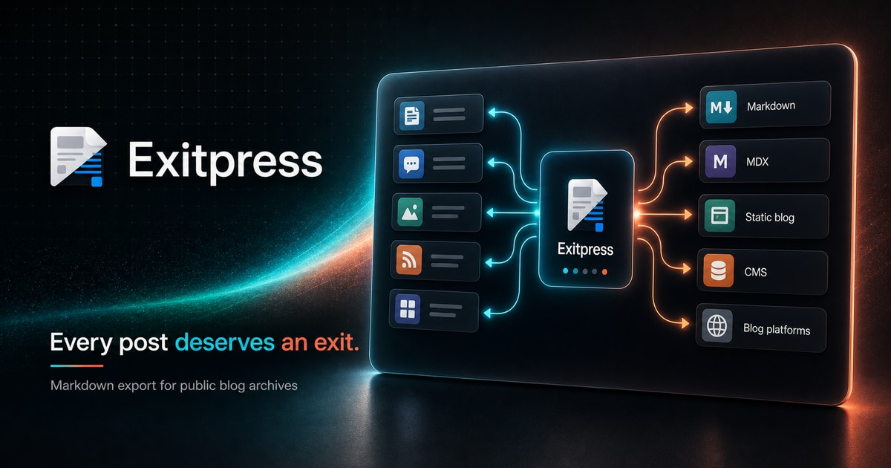

# Exitpress

[](https://codecov.io/gh/mym0404/exitpress)

Every post deserves an exit.

Exitpress는 공개 블로그 글을 스캔해 Markdown/MDX, frontmatter, 로컬 자산, 복구 가능한 `manifest.json`으로 내보내는 도구입니다. Naver Blog와 Tistory 공개 글 수집을 지원합니다.

[Website](https://mym0404.github.io/exitpress/) · [Parser Demo](https://mym0404.github.io/exitpress/storybook/)



## 내 블로그의 특정 블록이 파싱되지 않아요

1. 이 저장소를 fork합니다.
2. 내 컴퓨터에 [bun](https://bun.com/docs/installation)을 설치합니다. 설치한 뒤 `bun --version`을 실행해 봅니다.
3. 코딩 AI 에이전트에게 `$ingest-blog {내 블로그 id}`를 요청합니다. (현재는 `.agents/skills/ingest-blog`에 있는 스킬입니다.)
4. 파싱에 실패한 블록의 수정 사항이 PR로 올라옵니다. PR이 올라오기 전에는 원하는 대로 수정할 수 있습니다.

> [!NOTE]
> 위 스킬이 아직 매끄럽게 작동하지 않을 수 있습니다. 피드백을 주시면 감사하겠습니다.

## Rule-based HTML Parser는 계속 좋아집니다 🚀

이 저장소의 파서는 아래 과정을 거쳐 조금씩 개선됩니다.

[PR List](https://github.com/mym0404/exitpress/pulls?q=is%3Apr+label%3Aai-generated)

- AI는 자동화로 파서가 아직 잘 처리하지 못하는 블로그를 탐색
- 파싱되지 않는 블록을 단위별로 나눠 구조화
- 단위별로 아래 작업 실행
  - 해당 블록을 지원하는 코드 작성
  - Fixture, Coverage 검증으로 회귀 방지
  - PR 생성
- AI는 PR 목록에서 중복되거나 쓸모없다고 판단한 작업을 삭제
- 사람은 PR을 보고 마크다운 내보내기 옵션을 더 다양하게 만들거나 삭제

## 무엇을 할 수 있나요?

- ✅ Naver Blog SE2, SE3, ONE(SE4) 에디터와 Tistory 지원
- ✅ 다양한 이미지 처리 옵션
  1. 기존 글의 이미지 주소로 남겨두기
  2. 다운로드, 압축 후 로컬 경로로 변환하기
  3. **다운로드하고 압축한 뒤 PicList로 커스텀 Provider에 업로드하고 URI 변경하기**
- ✅ 동일한 이미지는 비교 후 **중복 다운로드하지 않음** (예를 들어, 특정 카테고리의 고정 썸네일은 중복 다운로드되거나 업로드되지 않음)
- ✅ 수백 가지 HTML 파싱 규칙이 계속 개선됨
- ✅ 각 블록의 여러 마크다운 내보내기 옵션
- ✅ GFM Markdown, Fumadocs MDX, Docusaurus MDX, Nextra MDX 출력 어댑터 지원
- ✅ Frontmatter 지원
- ✅ 같은 블로그 안의 다른 글 백링크를 자유 형식으로 변환 가능(예를 들어, 새 블로그로 이전할 때 해당 블로그의 https 주소나 상대 경로로 변경 가능)
- ✅ 그 외 다양한 옵션

> 현재는 공개 글만 수집할 수 있습니다.

## 빠른 시작

### 요구 사항

- [mise](https://mise.jdx.dev/)

### 설치

```bash
git clone https://github.com/mym0404/exitpress.git
cd exitpress
mise trust
mise install
pnpm install
```

### 실행

```bash
pnpm start
```

브라우저에서 [http://localhost:4173](http://localhost:4173)을 열면 됩니다.

기본 사용 순서입니다.

1. 블로그 플랫폼 선택
2. 블로그 ID 또는 URL 입력
3. 공개 글 스캔
4. 카테고리/날짜 범위 선택
5. 내보내기 실행
6. `output/` 아래 결과 확인

## 소개 웹사이트

영어 소개 페이지와 Parser Storybook은 GitHub Pages에서 볼 수 있습니다. 블로그 내보내기는 로컬에서 실행합니다.

```bash
mise exec -- pnpm --filter @exitpress/web build:pages
mise exec -- pnpm --filter @exitpress/web exec vite preview --config vite.website.config.ts
```

소개 페이지는 `dist/pages/`, Storybook은 `dist/pages/storybook/`에 빌드됩니다. `main`에 push하면 `pages` GitHub Actions가 두 페이지를 함께 배포합니다.

## 출력 형식

내보내기 단계에서 출력 어댑터를 고를 수 있습니다.

| Adapter | 결과 | 용도 |
| --- | --- | --- |
| `gfm` | 카테고리/글 폴더 아래 `index.md` | GitHub Flavored Markdown 기반 이전 |
| `fumadocs` | `content/docs/**/index.mdx`, `content/docs/**/meta.json`, `public/` | Fumadocs 프로젝트에 복사해 바로 쓰는 문서 번들 |
| `docusaurus` | `docs/**/index.mdx`, `docs/**/_category_.json`, `static/` | Docusaurus 프로젝트에 복사해 바로 쓰는 문서 번들 |
| `nextra` | `content/**/index.mdx`, `content/**/_meta.js`, `public/` | Nextra 프로젝트에 복사해 바로 쓰는 문서 번들 |

MDX 어댑터는 앱을 만들거나 기존 앱을 덮어쓰지 않습니다. 내보내기 결과에서 아래 폴더만 대상 앱으로 복사해 사용합니다.

| Adapter | 복사할 폴더 |
| --- | --- |
| `fumadocs` | `content/docs`, `public` |
| `docusaurus` | `docs`, `static` |
| `nextra` | `content`, `public` |

MDX 문서 경로는 라우팅 호환성을 위해 ASCII로 인코딩될 수 있습니다. 화면에 보이는 제목, 카테고리명, frontmatter 값은 원문을 유지합니다.
